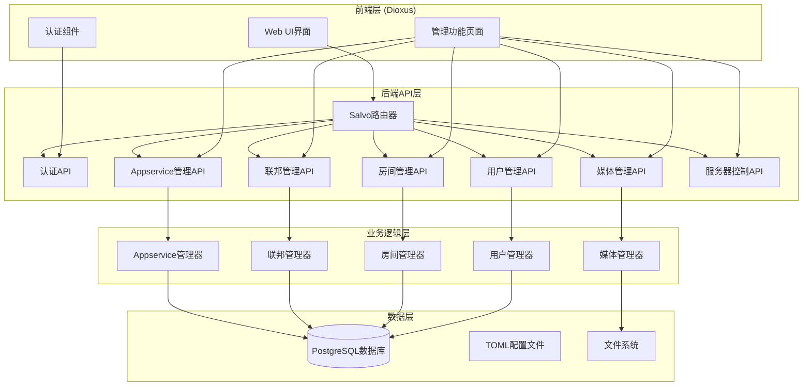

# 设计文档

## 概述

Palpo Matrix服务器web管理界面是一个现代化的管理控制台，允许管理员通过web浏览器可视化地管理Palpo Matrix服务器的所有配置和运营功能。该系统参考synapse-admin等成熟项目，提供更直观、安全和用户友好的管理体验。

设计采用前后端分离架构，后端提供RESTful API，前端使用Dioxus (Rust WebAssembly框架)构建现代化响应式用户界面。系统集成现有的配置管理、用户认证和数据库层，确保安全性和一致性。

## 架构

### 系统架构图



### 技术栈

**后端技术栈:**
- **Web框架**: Salvo
- **数据库**: PostgreSQL + Diesel ORM
- **认证**: JWT + Matrix认证
- **序列化**: serde + JSON

**前端技术栈:**
- **Web框架**: Dioxus (Rust WebAssembly框架)
- **样式**: TailwindCSS
- **状态管理**: Dioxus信号系统
- **HTTP客户端**: gloo-net
- **构建工具**: Dioxus CLI

## API设计

### 1. 用户管理API (UserAdminAPI)

```rust
// 用户管理API服务
pub struct UserAdminAPI;

impl UserAdminAPI {
    // 列出用户
    pub async fn list_users(filter: UserFilter) -> Result<UserListResponse, WebConfigError>;
    
    // 获取用户详情
    pub async fn get_user(user_id: &str) -> Result<UserDetail, WebConfigError>;
    
    // 创建用户
    pub async fn create_user(request: CreateUserRequest) -> Result<CreateUserResponse, WebConfigError>;
    
    // 更新用户
    pub async fn update_user(user_id: &str, request: UpdateUserRequest) -> Result<(), WebConfigError>;
    
    // 检查用户名可用性
    pub async fn check_username_availability(username: &str) -> Result<bool, WebConfigError>;
    
    // 重置密码
    pub async fn reset_password(user_id: &str, password: Option<String>) -> Result<String, WebConfigError>;
    
    // 停用用户
    pub async fn deactivate_user(user_id: &str, erase_data: bool, leave_rooms: bool) -> Result<(), WebConfigError>;
    
    // 重新激活用户
    pub async fn reactivate_user(user_id: &str) -> Result<(), WebConfigError>;
    
    // 锁定用户
    pub async fn lock_user(user_id: &str) -> Result<(), WebConfigError>;
    
    // 解锁用户
    pub async fn unlock_user(user_id: &str) -> Result<(), WebConfigError>;
    
    // 暂停用户 (MSC3823)
    pub async fn suspend_user(user_id: &str, reason: Option<String>) -> Result<(), WebConfigError>;
    
    // 取消暂停用户
    pub async fn unsuspend_user(user_id: &str) -> Result<(), WebConfigError>;
    
    // 擦除用户
    pub async fn erase_user(user_id: &str) -> Result<(), WebConfigError>;
    
    // 设置管理员权限
    pub async fn set_admin(user_id: &str, is_admin: bool) -> Result<(), WebConfigError>;
    
    // 获取用户设备列表
    pub async fn get_user_devices(user_id: &str) -> Result<Vec<DeviceInfo>, WebConfigError>;
    
    // 删除用户设备
    pub async fn delete_user_device(user_id: &str, device_id: &str) -> Result<(), WebConfigError>;
    
    // 获取用户连接信息
    pub async fn get_user_connections(user_id: &str) -> Result<ConnectionInfo, WebConfigError>;
    
    // 获取用户推送器列表
    pub async fn get_user_pushers(user_id: &str) -> Result<Vec<PusherInfo>, WebConfigError>;
    
    // 获取用户媒体列表
    pub async fn get_user_media(user_id: &str, filter: MediaFilter) -> Result<MediaListResponse, WebConfigError>;
    
    // 获取用户加入的房间列表
    pub async fn get_user_rooms(user_id: &str) -> Result<Vec<RoomInfo>, WebConfigError>;
    
    // 获取用户成员资格列表
    pub async fn get_user_memberships(user_id: &str) -> Result<Vec<MembershipInfo>, WebConfigError>;
    
    // 设置用户速率限制
    pub async fn set_user_rate_limits(user_id: &str, limits: RateLimitSettings) -> Result<(), WebConfigError>;
    
    // 获取用户速率限制
    pub async fn get_user_rate_limits(user_id: &str) -> Result<RateLimitSettings, WebConfigError>;
    
    // 管理用户实验功能
    pub async fn set_user_experimental_features(user_id: &str, features: HashMap<String, bool>) -> Result<(), WebConfigError>;
    
    // 获取用户实验功能
    pub async fn get_user_experimental_features(user_id: &str) -> Result<HashMap<String, bool>, WebConfigError>;
    
    // 管理用户账户数据
    pub async fn get_user_account_data(user_id: &str) -> Result<AccountData, WebConfigError>;
    
    // 更新用户账户数据
    pub async fn update_user_account_data(user_id: &str, data_type: &str, data: serde_json::Value) -> Result<(), WebConfigError>;
    
    // 删除用户账户数据
    pub async fn delete_user_account_data(user_id: &str, data_type: &str) -> Result<(), WebConfigError>;
    
    // 管理用户第三方标识
    pub async fn get_user_threepids(user_id: &str) -> Result<Vec<ThreepidInfo>, WebConfigError>;
    
    // 添加用户第三方标识
    pub async fn add_user_threepid(user_id: &str, medium: &str, address: &str) -> Result<(), WebConfigError>;
    
    // 删除用户第三方标识
    pub async fn delete_user_threepid(user_id: &str, medium: &str, address: &str) -> Result<(), WebConfigError>;
    
    // 管理用户SSO外部ID
    pub async fn get_user_external_ids(user_id: &str) -> Result<Vec<ExternalIdInfo>, WebConfigError>;
    
    // 添加用户SSO外部ID
    pub async fn add_user_external_id(user_id: &str, auth_provider: &str, external_id: &str) -> Result<(), WebConfigError>;
    
    // 删除用户SSO外部ID
    pub async fn delete_user_external_id(user_id: &str, auth_provider: &str, external_id: &str) -> Result<(), WebConfigError>;
    
    // 批量操作
    pub async fn batch_operation(request: BatchUserOperationRequest) -> Result<BatchUserOperationResponse, WebConfigError>;
    
    // 发送服务器通知
    pub async fn send_server_notice(user_id: &str, message: &str) -> Result<(), WebConfigError>;
}

// 数据模型
#[derive(Serialize, Deserialize, Clone, Debug)]
pub struct UserDetail {
    pub user_id: String,
    pub username: String,
    pub display_name: Option<String>,
    pub avatar_url: Option<String>,
    pub is_admin: bool,
    pub is_guest: bool,
    pub is_deactivated: bool,
    pub is_locked: bool,
    pub is_suspended: bool,
    pub is_erased: bool,
    pub creation_ts: u64,
    pub threepids: Vec<ThreepidInfo>,
    pub external_ids: Vec<ExternalIdInfo>,
    pub user_type: Option<String>,
}

#[derive(Serialize, Deserialize, Clone, Debug)]
pub struct ThreepidInfo {
    pub medium: String,
    pub address: String,
    pub added_at: u64,
    pub validated_at: Option<u64>,
}

#[derive(Serialize, Deserialize, Clone, Debug)]
pub struct ExternalIdInfo {
    pub auth_provider: String,
    pub external_id: String,
}

#[derive(Serialize, Deserialize, Clone, Debug)]
pub struct DeviceInfo {
    pub device_id: String,
    pub display_name: Option<String>,
    pub last_seen_ip: Option<String>,
    pub last_seen_user_agent: Option<String>,
    pub last_seen_ts: Option<u64>,
}

#[derive(Serialize, Deserialize, Clone, Debug)]
pub struct ConnectionInfo {
    pub user_id: String,
    pub devices: Vec<DeviceInfo>,
}

#[derive(Serialize, Deserialize, Clone, Debug)]
pub struct PusherInfo {
    pub pusher_id: String,
    pub kind: String,
    pub app_display_name: String,
    pub app_id: String,
    pub device_display_name: Option<String>,
    pub profile_tag: Option<String>,
    pub lang: Option<String>,
}

#[derive(Serialize, Deserialize, Clone, Debug)]
pub struct RateLimitSettings {
    pub messages_per_second: Option<u64>,
    pub burst_count: Option<u64>,
}

#[derive(Serialize, Deserialize, Clone, Debug)]
pub struct AccountData {
    pub global: HashMap<String, serde_json::Value>,
    pub rooms: HashMap<String, HashMap<String, serde_json::Value>>,
}

#[derive(Serialize, Deserialize, Clone, Debug)]
pub struct MembershipInfo {
    pub room_id: String,
    pub room_name: Option<String>,
    pub membership: String,
    pub joined_at: Option<u64>,
}

#[derive(Serialize, Deserialize, Clone, Debug)]
pub struct BatchUserOperationRequest {
    pub user_ids: Vec<String>,
    pub operation: BatchUserOperation,
}

#[derive(Serialize, Deserialize, Clone, Debug)]
pub enum BatchUserOperation {
    Deactivate { erase_data: bool, leave_rooms: bool },
    Reactivate,
    Lock,
    Unlock,
    SendNotice { message: String },
}
```

### 2. 房间管理API (RoomAdminAPI)

```rust
pub struct RoomAdminAPI;

impl RoomAdminAPI {
    // 列出房间
    pub async fn list_rooms(filter: RoomFilter) -> Result<RoomListResponse, WebConfigError>;
    
    // 获取房间详情
    pub async fn get_room_detail(room_id: &str) -> Result<RoomDetail, WebConfigError>;
    
    // 获取房间成员列表
    pub async fn get_room_members(room_id: &str) -> Result<Vec<RoomMemberDetail>, WebConfigError>;
    
    // 获取房间状态事件
    pub async fn get_room_state(room_id: &str, filter: Option<Vec<String>>) -> Result<Vec<StateEvent>, WebConfigError>;
    
    // 获取房间媒体列表
    pub async fn get_room_media(room_id: &str) -> Result<Vec<MediaInfo>, WebConfigError>;
    
    // 获取房间前沿终点
    pub async fn get_room_forward_extremities(room_id: &str) -> Result<Vec<ForwardExtremity>, WebConfigError>;
    
    // 发布房间到目录
    pub async fn publish_room(room_id: &str) -> Result<(), WebConfigError>;
    
    // 从目录取消发布
    pub async fn unpublish_room(room_id: &str) -> Result<(), WebConfigError>;
    
    // 批量发布房间到目录
    pub async fn batch_publish_rooms(room_ids: Vec<String>) -> Result<BatchPublishResult, WebConfigError>;
    
    // 批量从目录取消发布
    pub async fn batch_unpublish_rooms(room_ids: Vec<String>) -> Result<BatchPublishResult, WebConfigError>;
    
    // 设置房间管理员
    pub async fn make_room_admin(room_id: &str, user_id: &str) -> Result<(), WebConfigError>;
    
    // 删除房间
    pub async fn delete_room(room_id: &str, block: bool) -> Result<(), WebConfigError>;
    
    // 禁用房间
    pub async fn disable_room(room_id: &str) -> Result<(), WebConfigError>;
    
    // 启用房间
    pub async fn enable_room(room_id: &str) -> Result<(), WebConfigError>;
}

#[derive(Serialize, Deserialize, Clone, Debug)]
pub struct RoomDetail {
    pub room_id: String,
    pub name: Option<String>,
    pub canonical_alias: Option<String>,
    pub topic: Option<String>,
    pub avatar_url: Option<String>,
    pub creator: String,
    pub member_count: u64,
    pub joined_local_members: u64,
    pub joined_local_devices: u64,
    pub state_events_count: u64,
    pub version: String,
    pub is_encrypted: bool,
    pub encryption: Option<String>,
    pub is_federatable: bool,
    pub is_public: bool,
    pub join_rule: String,
    pub guest_access: String,
    pub history_visibility: String,
    pub room_type: Option<String>,
}

#[derive(Serialize, Deserialize, Clone, Debug)]
pub struct RoomMemberDetail {
    pub user_id: String,
    pub display_name: Option<String>,
    pub avatar_url: Option<String>,
    pub is_guest: bool,
    pub is_deactivated: bool,
    pub is_locked: bool,
    pub is_erased: bool,
    pub membership: String,
    pub power_level: u64,
    pub is_admin: bool,
}

#[derive(Serialize, Deserialize, Clone, Debug)]
pub struct StateEvent {
    pub event_id: String,
    pub event_type: String,
    pub origin_server_ts: u64,
    pub sender: String,
    pub content: serde_json::Value,
    pub state_key: Option<String>,
}

#[derive(Serialize, Deserialize, Clone, Debug)]
pub struct ForwardExtremity {
    pub event_id: String,
    pub state_group: u64,
    pub depth: u64,
    pub received_ts: u64,
}

#[derive(Serialize, Deserialize, Clone, Debug)]
pub struct BatchPublishResult {
    pub success_count: u64,
    pub failed_count: u64,
    pub failed_rooms: Vec<String>,
}
```

### 3. 媒体管理API (MediaAdminAPI)

```rust
pub struct MediaAdminAPI;

impl MediaAdminAPI {
    // 获取媒体统计
    pub async fn get_media_stats() -> Result<MediaStatsResponse, WebConfigError>;
    
    // 获取详细媒体统计
    pub async fn get_detailed_media_stats() -> Result<DetailedMediaStats, WebConfigError>;
    
    // 列出媒体文件
    pub async fn list_media(filter: MediaFilter) -> Result<MediaListResponse, WebConfigError>;
    
    // 获取媒体文件信息
    pub async fn get_media_info(mxc_uri: &str) -> Result<MediaInfo, WebConfigError>;
    
    // 删除媒体文件
    pub async fn delete_media(mxc_uri: &str, reason: Option<String>) -> Result<DeleteMediaResult, WebConfigError>;
    
    // 批量删除媒体文件
    pub async fn delete_media_batch(mxc_uris: Vec<String>, reason: Option<String>) -> Result<BatchDeleteResult, WebConfigError>;
    
    // 隔离媒体文件
    pub async fn quarantine_media(mxc_uri: &str) -> Result<(), WebConfigError>;
    
    // 取消隔离媒体文件
    pub async fn unquarantine_media(mxc_uri: &str) -> Result<(), WebConfigError>;
    
    // 保护媒体文件
    pub async fn protect_media(mxc_uri: &str) -> Result<(), WebConfigError>;
    
    // 取消保护媒体文件
    pub async fn unprotect_media(mxc_uri: &str) -> Result<(), WebConfigError>;
    
    // 清理远程媒体
    pub async fn purge_remote_media(before_ts: u64, keep_profiles: bool) -> Result<PurgeMediaResult, WebConfigError>;
    
    // 获取用户媒体统计
    pub async fn get_user_media_stats(filter: Option<UserMediaFilter>) -> Result<Vec<UserMediaStats>, WebConfigError>;
}

#[derive(Serialize, Deserialize, Clone, Debug)]
pub struct MediaStatsResponse {
    pub total_files: u64,
    pub total_size: u64,
    pub local_files: u64,
    pub local_size: u64,
    pub remote_files: u64,
    pub remote_size: u64,
    pub quarantined_files: u64,
    pub quarantined_size: u64,
}

#[derive(Serialize, Deserialize, Clone, Debug)]
pub struct DetailedMediaStats {
    pub basic_stats: MediaStatsResponse,
    pub by_content_type: Vec<MediaStorageByType>,
    pub by_uploader: Vec<MediaStorageByUploader>,
    pub daily_uploads: Vec<DailyUploadStats>,
}

#[derive(Serialize, Deserialize, Clone, Debug)]
pub struct MediaStorageByType {
    pub content_type: String,
    pub file_count: u64,
    pub total_size: u64,
    pub percentage: f64,
}

#[derive(Serialize, Deserialize, Clone, Debug)]
pub struct MediaStorageByUploader {
    pub user_id: String,
    pub display_name: Option<String>,
    pub file_count: u64,
    pub total_size: u64,
    pub percentage: f64,
}

#[derive(Serialize, Deserialize, Clone, Debug)]
pub struct UserMediaStats {
    pub user_id: String,
    pub display_name: Option<String>,
    pub media_count: u64,
    pub media_length: u64,
}
```

### 4. 房间目录API (RoomDirectoryAPI)

```rust
pub struct RoomDirectoryAPI;

impl RoomDirectoryAPI {
    // 列出公开房间
    pub async fn list_public_rooms(filter: PublicRoomFilter) -> Result<PublicRoomListResponse, WebConfigError>;
    
    // 发布房间到目录
    pub async fn publish_room(room_id: &str) -> Result<(), WebConfigError>;
    
    // 从目录取消发布
    pub async fn unpublish_room(room_id: &str) -> Result<(), WebConfigError>;
    
    // 批量发布
    pub async fn batch_publish(room_ids: Vec<String>) -> Result<BatchPublishResult, WebConfigError>;
    
    // 批量取消发布
    pub async fn batch_unpublish(room_ids: Vec<String>) -> Result<BatchPublishResult, WebConfigError>;
}

#[derive(Serialize, Deserialize, Clone, Debug)]
pub struct PublicRoomListResponse {
    pub rooms: Vec<PublicRoomInfo>,
    pub total_count: u64,
    pub has_more: bool,
}

#[derive(Serialize, Deserialize, Clone, Debug)]
pub struct PublicRoomInfo {
    pub room_id: String,
    pub name: Option<String>,
    pub canonical_alias: Option<String>,
    pub topic: Option<String>,
    pub avatar_url: Option<String>,
    pub num_joined_members: u64,
    pub world_readable: bool,
    pub guest_can_join: bool,
}
```

### 5. 联邦目的地API (FederationDestinationsAPI)

```rust
pub struct FederationDestinationsAPI;

impl FederationDestinationsAPI {
    // 列出联邦目的地
    pub async fn list_destinations(filter: DestinationFilter) -> Result<DestinationListResponse, WebConfigError>;
    
    // 获取目的地详情
    pub async fn get_destination_detail(destination: &str) -> Result<DestinationDetail, WebConfigError>;
    
    // 重置连接
    pub async fn reset_connection(destination: &str) -> Result<(), WebConfigError>;
    
    // 获取目的地房间列表
    pub async fn get_destination_rooms(destination: &str) -> Result<Vec<DestinationRoomInfo>, WebConfigError>;
}

#[derive(Serialize, Deserialize, Clone, Debug)]
pub struct DestinationListResponse {
    pub destinations: Vec<DestinationInfo>,
    pub total_count: u64,
}

#[derive(Serialize, Deserialize, Clone, Debug)]
pub struct DestinationInfo {
    pub destination: String,
    pub retry_last_ts: u64,
    pub retry_interval: u64,
    pub failure_ts: Option<u64>,
    pub last_successful_stream_ordering: Option<u64>,
}

#[derive(Serialize, Deserialize, Clone, Debug)]
pub struct DestinationDetail {
    pub destination: String,
    pub retry_last_ts: u64,
    pub retry_interval: u64,
    pub failure_ts: Option<u64>,
    pub last_successful_stream_ordering: Option<u64>,
    pub rooms: Vec<DestinationRoomInfo>,
}

#[derive(Serialize, Deserialize, Clone, Debug)]
pub struct DestinationRoomInfo {
    pub room_id: String,
    pub stream_ordering: u64,
    pub room_name: Option<String>,
}
```

### 6. 注册令牌API (RegistrationTokensAPI)

```rust
pub struct RegistrationTokensAPI;

impl RegistrationTokensAPI {
    // 列出注册令牌
    pub async fn list_tokens(filter: Option<TokenFilter>) -> Result<Vec<RegistrationTokenInfo>, WebConfigError>;
    
    // 创建注册令牌
    pub async fn create_token(request: CreateTokenRequest) -> Result<RegistrationTokenInfo, WebConfigError>;
    
    // 更新注册令牌
    pub async fn update_token(token: &str, request: UpdateTokenRequest) -> Result<(), WebConfigError>;
    
    // 删除注册令牌
    pub async fn delete_token(token: &str) -> Result<(), WebConfigError>;
}

#[derive(Serialize, Deserialize, Clone, Debug)]
pub struct RegistrationTokenInfo {
    pub token: String,
    pub uses_allowed: u64,
    pub pending: u64,
    pub completed: u64,
    pub expiry_time: Option<u64>,
    pub valid: bool,
}

#[derive(Serialize, Deserialize, Clone, Debug)]
pub struct CreateTokenRequest {
    pub token: Option<String>,
    pub length: Option<u64>,
    pub uses_allowed: Option<u64>,
    pub expiry_time: Option<u64>,
}

#[derive(Serialize, Deserialize, Clone, Debug)]
pub struct UpdateTokenRequest {
    pub uses_allowed: Option<u64>,
    pub expiry_time: Option<u64>,
}
```

### 7. 举报管理API (ReportsAPI)

```rust
pub struct ReportsAPI;

impl ReportsAPI {
    // 列出举报
    pub async fn list_reports(filter: ReportFilter) -> Result<ReportListResponse, WebConfigError>;
    
    // 获取举报详情
    pub async fn get_report_detail(report_id: u64) -> Result<ReportDetail, WebConfigError>;
    
    // 删除举报
    pub async fn delete_report(report_id: u64) -> Result<(), WebConfigError>;
}

#[derive(Serialize, Deserialize, Clone, Debug)]
pub struct ReportListResponse {
    pub reports: Vec<ReportInfo>,
    pub total_count: u64,
}

#[derive(Serialize, Deserialize, Clone, Debug)]
pub struct ReportInfo {
    pub id: u64,
    pub received_ts: u64,
    pub user_id: String,
    pub room_id: String,
    pub room_name: Option<String>,
    pub score: i64,
    pub reason: Option<String>,
}

#[derive(Serialize, Deserialize, Clone, Debug)]
pub struct ReportDetail {
    pub id: u64,
    pub received_ts: u64,
    pub user_id: String,
    pub room_id: String,
    pub room_name: Option<String>,
    pub canonical_alias: Option<String>,
    pub score: i64,
    pub reason: Option<String>,
    pub event_id: String,
    pub event: EventInfo,
}

#[derive(Serialize, Deserialize, Clone, Debug)]
pub struct EventInfo {
    pub event_id: String,
    pub event_type: String,
    pub sender: String,
    pub origin_server_ts: u64,
    pub content: serde_json::Value,
    pub url: Option<String>,
}
```

### 8. 设备管理API (DevicesAPI)

```rust
pub struct DevicesAPI;

impl DevicesAPI {
    // 列出用户设备
    pub async fn list_user_devices(user_id: &str) -> Result<Vec<DeviceDetail>, WebConfigError>;
    
    // 删除用户设备
    pub async fn delete_user_device(user_id: &str, device_id: &str) -> Result<(), WebConfigError>;
}
```

### 9. 认证API (AuthAPI)

```rust
pub struct AuthAPI;

impl AuthAPI {
    // 用户名密码登录
    pub async fn login(request: LoginRequest) -> Result<LoginResponse, WebConfigError>;
    
    // 访问令牌登录
    pub async fn login_with_token(request: TokenLoginRequest) -> Result<LoginResponse, WebConfigError>;
    
    // 刷新访问令牌
    pub async fn refresh_token(refresh_token: &str) -> Result<TokenRefreshResponse, WebConfigError>;
    
    // 登出
    pub async fn logout(session_id: &str) -> Result<(), WebConfigError>;
    
    // 验证会话
    pub async fn validate_session() -> Result<SessionValidationResponse, WebConfigError>;
}

#[derive(Serialize, Deserialize, Clone, Debug)]
pub struct LoginRequest {
    pub username: String,
    pub password: String,
    pub server_url: String,
}

#[derive(Serialize, Deserialize, Clone, Debug)]
pub struct LoginResponse {
    pub success: bool,
    pub access_token: Option<String>,
    pub refresh_token: Option<String>,
    pub expires_in: u64,
    pub user: Option<AdminUser>,
    pub error: Option<String>,
}

#[derive(Serialize, Deserialize, Clone, Debug)]
pub struct TokenLoginRequest {
    pub access_token: String,
    pub server_url: String,
}
```

## 前端组件架构

### 页面结构

```rust
use dioxus::prelude::*;
use dioxus_router::prelude::*;

#[derive(Clone, Routable, Debug, PartialEq)]
enum Route {
    #[route("/")]
    Home {},
    #[route("/admin")]
    AdminLayout {
        #[nest]
        child: AdminRoute,
    },
    #[route("/login")]
    Login {},
}

#[derive(Clone, Routable, Debug, PartialEq)]
enum AdminRoute {
    #[route("/")]
    Dashboard {},
    #[route("/users")]
    UserManager {},
    #[route("/users/:id")]
    UserDetail { id: String },
    #[route("/rooms")]
    RoomManager {},
    #[route("/rooms/:id")]
    RoomDetail { id: String },
    #[route("/media")]
    MediaManager {},
    #[route("/room-directory")]
    RoomDirectory {},
    #[route("/federation/destinations")]
    FederationDestinations {},
    #[route("/registration-tokens")]
    RegistrationTokens {},
    #[route("/reports")]
    Reports {},
    #[route("/devices/:user_id")]
    UserDevices { user_id: String },
    #[route("/config")]
    ConfigManager {},
    #[route("/server/status")]
    ServerStatus {},
    #[route("/server/commands")]
    ServerCommands {},
    #[route("/appservices")]
    AppserviceManager {},
    #[route("/logs")]
    AuditLogs {},
}
```

### 状态管理

```rust
// 认证状态
#[derive(Clone, Debug, PartialEq)]
pub enum AuthState {
    Unauthenticated,
    Authenticating,
    Authenticated(AdminUser),
    Failed(String),
}

// 应用状态
#[derive(Clone, Debug, PartialEq)]
pub struct AppState {
    pub current_page: String,
    pub is_loading: bool,
    pub error: Option<String>,
    pub theme: Theme,
}

#[derive(Clone, Debug, PartialEq)]
pub enum Theme {
    Light,
    Dark,
}
```

## 错误处理

```rust
#[derive(Debug, thiserror::Error)]
pub enum WebConfigError {
    #[error("Permission denied: {message}")]
    Permission { message: String },
    
    #[error("Validation error: {message}")]
    Validation { message: String, field: Option<String> },
    
    #[error("Not found: {resource}")]
    NotFound { resource: String },
    
    #[error("Internal error: {message}")]
    Internal { message: String },
    
    #[error("Authentication error: {message}")]
    Authentication { message: String },
}
```

## 安全考虑

1. **认证**: 所有管理API需要有效的访问令牌
2. **权限检查**: 某些操作需要特定权限
3. **CSRF保护**: 使用SameSite Cookie和CSRF令牌
4. **输入验证**: 所有用户输入都需要验证
5. **审计日志**: 所有管理操作都记录审计日志