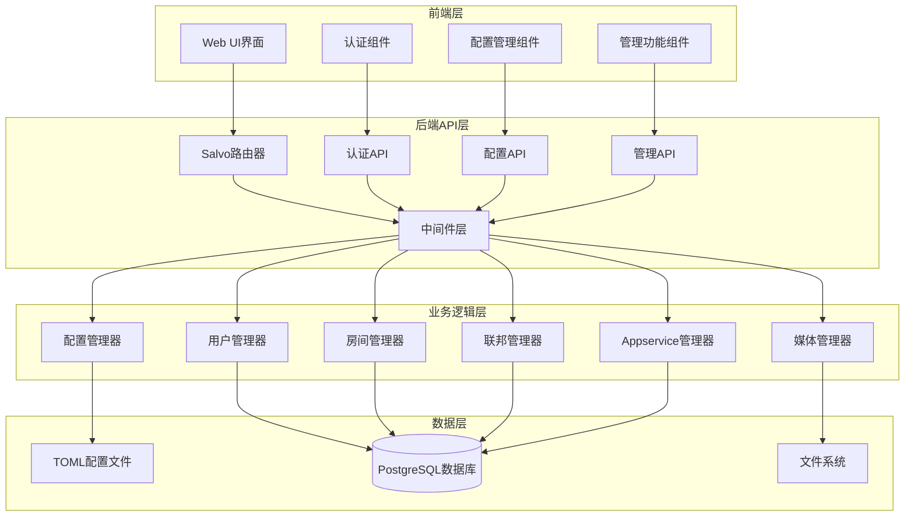

# 设计文档

## 概述

Palpo Matrix服务器web配置页面是一个现代化的管理界面，基于Rust + Salvo web框架构建。该系统将现有的命令行管理功能转换为直观的web界面，同时保持与现有架构的完全兼容性。

设计采用前后端分离架构，后端提供RESTful API，前端使用Dioxus (Rust WebAssembly框架)构建现代化响应式用户界面。系统集成现有的配置管理、用户认证和数据库层，确保安全性和一致性。

## 架构

### 系统架构图



### 技术栈

**后端技术栈:**
- **Web框架**: Salvo (现有)
- **数据库**: PostgreSQL + Diesel ORM (现有)
- **配置管理**: Figment库 (现有)
- **认证**: JWT + Matrix认证 (现有)
- **序列化**: serde + TOML/JSON

**前端技术栈 (Rust实现):**
- **Web框架**: Dioxus (Rust全栈Web框架)
- **样式**: TailwindCSS + Dioxus样式系统
- **状态管理**: Dioxus信号和上下文系统
- **HTTP客户端**: reqwest (WASM兼容)
- **构建工具**: Dioxus CLI + Trunk
- **组件库**: 基于Dioxus的自定义组件

**技术选型理由:**
- **React-like语法**: 熟悉的组件化开发模式，学习曲线平缓
- **多平台支持**: Web、桌面、移动端统一技术栈
- **性能优秀**: 编译到WebAssembly，运行速度快
- **类型安全**: 完全的Rust类型系统支持，可直接复用Palpo配置结构体
- **开发体验**: 热重载、优秀的调试工具

## 组件和接口

### 后端API组件

#### 1. 认证中间件 (AuthMiddleware)

```rust
pub struct AuthMiddleware;

impl AuthMiddleware {
    pub async fn require_admin(depot: &mut Depot) -> AppResult<()>;
    pub async fn validate_session(depot: &mut Depot) -> AppResult<()>;
    pub fn get_admin_user(depot: &Depot) -> Option<&AdminUser>;
}

pub struct AdminUser {
    pub user_id: OwnedUserId,
    pub is_admin: bool,
    pub session_id: String,
    pub expires_at: SystemTime,
}
```

#### 2. 配置API (ConfigAPI)

```rust
pub struct ConfigAPI;

impl ConfigAPI {
    pub async fn get_config() -> AppResult<ServerConfigResponse>;
    pub async fn update_config(config: UpdateConfigRequest) -> AppResult<()>;
    pub async fn validate_config(config: ValidateConfigRequest) -> AppResult<ValidationResult>;
    pub async fn reload_config() -> AppResult<()>;
    pub async fn export_config() -> AppResult<ConfigExportResponse>;
    pub async fn import_config(config: ConfigImportRequest) -> AppResult<()>;
}

#[derive(Serialize, Deserialize)]
pub struct ServerConfigResponse {
    pub server: ServerConfig,
    pub database: DatabaseConfig,
    pub federation: FederationConfig,
    pub auth: AuthConfig,
    pub media: MediaConfig,
    pub network: NetworkConfig,
    pub logging: LoggingConfig,
}

#[derive(Serialize, Deserialize)]
pub struct ValidationResult {
    pub valid: bool,
    pub errors: Vec<ConfigError>,
    pub warnings: Vec<ConfigWarning>,
}
```

#### 3. 用户管理API (UserAdminAPI)

```rust
pub struct UserAdminAPI;

impl UserAdminAPI {
    pub async fn list_users(filter: UserFilter) -> AppResult<UserListResponse>;
    pub async fn create_user(request: CreateUserRequest) -> AppResult<UserResponse>;
    pub async fn get_user(user_id: &UserId) -> AppResult<UserResponse>;
    pub async fn update_user(user_id: &UserId, request: UpdateUserRequest) -> AppResult<()>;
    pub async fn deactivate_user(user_id: &UserId, leave_rooms: bool) -> AppResult<()>;
    pub async fn reset_password(user_id: &UserId, password: Option<String>) -> AppResult<String>;
    pub async fn set_admin(user_id: &UserId, is_admin: bool) -> AppResult<()>;
    pub async fn list_user_rooms(user_id: &UserId) -> AppResult<Vec<RoomInfo>>;
}

#[derive(Serialize, Deserialize)]
pub struct UserListResponse {
    pub users: Vec<UserInfo>,
    pub total: usize,
    pub page: usize,
}

#[derive(Serialize, Deserialize)]
pub struct UserInfo {
    pub user_id: OwnedUserId,
    pub display_name: Option<String>,
    pub avatar_url: Option<String>,
    pub is_admin: bool,
    pub is_guest: bool,
    pub is_deactivated: bool,
    pub created_at: SystemTime,
    pub last_seen: Option<SystemTime>,
}
```

#### 4. 房间管理API (RoomAdminAPI)

```rust
pub struct RoomAdminAPI;

impl RoomAdminAPI {
    pub async fn list_rooms(filter: RoomFilter) -> AppResult<RoomListResponse>;
    pub async fn get_room_info(room_id: &RoomId) -> AppResult<RoomDetailResponse>;
    pub async fn disable_room(room_id: &RoomId) -> AppResult<()>;
    pub async fn enable_room(room_id: &RoomId) -> AppResult<()>;
    pub async fn delete_room(room_id: &RoomId) -> AppResult<()>;
    pub async fn force_join_user(user_id: &UserId, room_id: &RoomId) -> AppResult<()>;
    pub async fn force_leave_user(user_id: &UserId, room_id: &RoomId) -> AppResult<()>;
}

#[derive(Serialize, Deserialize)]
pub struct RoomDetailResponse {
    pub room_id: OwnedRoomId,
    pub name: Option<String>,
    pub topic: Option<String>,
    pub avatar_url: Option<String>,
    pub member_count: u64,
    pub is_public: bool,
    pub is_federated: bool,
    pub is_disabled: bool,
    pub created_at: SystemTime,
    pub members: Vec<RoomMemberInfo>,
}
```

#### 5. 联邦管理API (FederationAdminAPI)

```rust
pub struct FederationAdminAPI;

impl FederationAdminAPI {
    pub async fn list_destinations() -> AppResult<Vec<FederationDestination>>;
    pub async fn get_destination_info(server_name: &ServerName) -> AppResult<DestinationInfo>;
    pub async fn disable_destination(server_name: &ServerName) -> AppResult<()>;
    pub async fn enable_destination(server_name: &ServerName) -> AppResult<()>;
    pub async fn test_federation(server_name: &ServerName) -> AppResult<FederationTestResult>;
    pub async fn fetch_support_info(server_name: &ServerName) -> AppResult<SupportInfo>;
}

#[derive(Serialize, Deserialize)]
pub struct FederationDestination {
    pub server_name: OwnedServerName,
    pub is_reachable: bool,
    pub last_successful_send: Option<SystemTime>,
    pub failure_count: u32,
    pub shared_rooms: Vec<OwnedRoomId>,
}
```

#### 6. 媒体管理API (MediaAdminAPI)

```rust
pub struct MediaAdminAPI;

impl MediaAdminAPI {
    pub async fn get_media_stats() -> AppResult<MediaStatsResponse>;
    pub async fn list_media(filter: MediaFilter) -> AppResult<MediaListResponse>;
    pub async fn get_media_info(mxc_uri: &str) -> AppResult<MediaInfo>;
    pub async fn delete_media(mxc_uri: &str) -> AppResult<()>;
    pub async fn delete_media_batch(mxc_uris: Vec<String>) -> AppResult<BatchDeleteResult>;
    pub async fn cleanup_old_media(before: SystemTime, include_local: bool) -> AppResult<CleanupResult>;
}

#[derive(Serialize, Deserialize)]
pub struct MediaStatsResponse {
    pub total_files: u64,
    pub total_size: u64,
    pub local_files: u64,
    pub local_size: u64,
    pub remote_files: u64,
    pub remote_size: u64,
}
```

#### 8. 服务器控制API (ServerControlAPI)

```rust
pub struct ServerControlAPI;

impl ServerControlAPI {
    pub async fn get_server_status() -> AppResult<ServerStatusResponse>;
    pub async fn reload_config() -> AppResult<ConfigReloadResult>;
    pub async fn restart_server(force: bool) -> AppResult<()>;
    pub async fn shutdown_server(graceful: bool) -> AppResult<()>;
    pub async fn get_server_features() -> AppResult<Vec<ServerFeature>>;
    pub async fn send_admin_notice(message: String) -> AppResult<()>;
    pub async fn execute_admin_command(command: AdminCommand) -> AppResult<CommandResult>;
}

#[derive(Serialize, Deserialize)]
pub struct ServerStatusResponse {
    pub uptime: Duration,
    pub version: String,
    pub features: Vec<String>,
    pub active_connections: u32,
    pub memory_usage: u64,
    pub config_last_modified: SystemTime,
}

#[derive(Serialize, Deserialize)]
pub struct ConfigReloadResult {
    pub success: bool,
    pub errors: Vec<String>,
    pub warnings: Vec<String>,
    pub hot_reload_supported: bool,
}

#[derive(Serialize, Deserialize)]
pub struct AdminCommand {
    pub command: String,
    pub args: Vec<String>,
    pub require_confirmation: bool,
}

#[derive(Serialize, Deserialize)]
pub struct CommandResult {
    pub success: bool,
    pub output: String,
    pub error: Option<String>,
    pub execution_time: Duration,
}
```

```rust
pub struct AppserviceAdminAPI;

impl AppserviceAdminAPI {
    pub async fn list_appservices() -> AppResult<Vec<AppserviceInfo>>;
    pub async fn get_appservice(id: &str) -> AppResult<AppserviceDetail>;
    pub async fn register_appservice(config: AppserviceConfig) -> AppResult<()>;
    pub async fn unregister_appservice(id: &str) -> AppResult<()>;
    pub async fn test_appservice(id: &str) -> AppResult<AppserviceTestResult>;
}

#[derive(Serialize, Deserialize)]
pub struct AppserviceInfo {
    pub id: String,
    pub url: String,
    pub sender_localpart: String,
    pub is_active: bool,
    pub namespaces: AppserviceNamespaces,
}
```

#### 8. 服务器控制API (ServerControlAPI)

```rust
pub struct ServerControlAPI;

impl ServerControlAPI {
    pub async fn get_server_status() -> AppResult<ServerStatusResponse>;
    pub async fn reload_config() -> AppResult<ConfigReloadResult>;
    pub async fn restart_server(force: bool) -> AppResult<()>;
    pub async fn shutdown_server(graceful: bool) -> AppResult<()>;
    pub async fn get_server_features() -> AppResult<Vec<ServerFeature>>;
    pub async fn send_admin_notice(message: String) -> AppResult<()>;
    pub async fn execute_admin_command(command: AdminCommand) -> AppResult<CommandResult>;
}

#[derive(Serialize, Deserialize)]
pub struct ServerStatusResponse {
    pub uptime: Duration,
    pub version: String,
    pub features: Vec<String>,
    pub active_connections: u32,
    pub memory_usage: u64,
    pub config_last_modified: SystemTime,
    pub hot_reload_supported: bool,
}

#[derive(Serialize, Deserialize)]
pub struct ConfigReloadResult {
    pub success: bool,
    pub errors: Vec<String>,
    pub warnings: Vec<String>,
    pub hot_reload_supported: bool,
    pub restart_required: bool,
}

#[derive(Serialize, Deserialize)]
pub struct AdminCommand {
    pub command: String,
    pub args: Vec<String>,
    pub require_confirmation: bool,
    pub timeout_seconds: Option<u64>,
}

#[derive(Serialize, Deserialize)]
pub struct CommandResult {
    pub success: bool,
    pub output: String,
    pub error: Option<String>,
    pub execution_time: Duration,
    pub exit_code: Option<i32>,
}

#[derive(Serialize, Deserialize)]
pub struct ServerFeature {
    pub name: String,
    pub enabled: bool,
    pub description: String,
    pub requires_restart: bool,
}
```

#### 9. 配置模板API (ConfigTemplateAPI)

```rust
pub struct ConfigTemplateAPI;

impl ConfigTemplateAPI {
    pub async fn list_templates() -> AppResult<Vec<ConfigTemplate>>;
    pub async fn get_template(template_id: &str) -> AppResult<ConfigTemplateDetail>;
    pub async fn create_template(template: CreateTemplateRequest) -> AppResult<String>;
    pub async fn update_template(template_id: &str, template: UpdateTemplateRequest) -> AppResult<()>;
    pub async fn delete_template(template_id: &str) -> AppResult<()>;
    pub async fn apply_template(template_id: &str, overrides: Option<serde_json::Value>) -> AppResult<ServerConfig>;
    pub async fn validate_template(template: ConfigTemplateData) -> AppResult<TemplateValidationResult>;
    pub async fn export_current_as_template(name: String, description: String) -> AppResult<String>;
}

#[derive(Serialize, Deserialize)]
pub struct ConfigTemplate {
    pub id: String,
    pub name: String,
    pub description: String,
    pub category: TemplateCategory,
    pub created_at: SystemTime,
    pub updated_at: SystemTime,
    pub is_builtin: bool,
    pub compatible_versions: Vec<String>,
}

#[derive(Serialize, Deserialize)]
pub struct ConfigTemplateDetail {
    pub template: ConfigTemplate,
    pub config_data: serde_json::Value,
    pub required_fields: Vec<String>,
    pub optional_fields: Vec<String>,
}

#[derive(Serialize, Deserialize)]
pub enum TemplateCategory {
    Development,
    Production,
    Testing,
    Custom,
    Federation,
    Security,
}

#[derive(Serialize, Deserialize)]
pub struct CreateTemplateRequest {
    pub name: String,
    pub description: String,
    pub category: TemplateCategory,
    pub config_data: serde_json::Value,
    pub required_fields: Vec<String>,
}

#[derive(Serialize, Deserialize)]
pub struct TemplateValidationResult {
    pub valid: bool,
    pub errors: Vec<String>,
    pub warnings: Vec<String>,
    pub missing_required_fields: Vec<String>,
}
```

#### 10. 配置导入导出增强API (ConfigImportExportAPI)

```rust
pub struct ConfigImportExportAPI;

impl ConfigImportExportAPI {
    pub async fn export_config(options: ExportOptions) -> AppResult<ConfigExportResponse>;
    pub async fn import_config(request: ConfigImportRequest) -> AppResult<ImportResult>;
    pub async fn preview_import(request: ConfigImportRequest) -> AppResult<ImportPreview>;
    pub async fn validate_import_file(file_content: String, format: ConfigFormat) -> AppResult<ImportValidationResult>;
    pub async fn get_export_formats() -> AppResult<Vec<ExportFormat>>;
    pub async fn create_migration_script(from_version: String, to_version: String) -> AppResult<MigrationScript>;
}

#[derive(Serialize, Deserialize)]
pub struct ExportOptions {
    pub format: ConfigFormat,
    pub include_sensitive: bool,
    pub include_defaults: bool,
    pub sections: Option<Vec<String>>,
    pub encrypt: bool,
    pub encryption_key: Option<String>,
}

#[derive(Serialize, Deserialize)]
pub struct ConfigExportResponse {
    pub content: String,
    pub format: ConfigFormat,
    pub exported_at: SystemTime,
    pub checksum: String,
    pub size_bytes: u64,
}

#[derive(Serialize, Deserialize)]
pub struct ConfigImportRequest {
    pub content: String,
    pub format: ConfigFormat,
    pub merge_strategy: MergeStrategy,
    pub validate_only: bool,
    pub backup_current: bool,
    pub encryption_key: Option<String>,
}

#[derive(Serialize, Deserialize)]
pub struct ImportResult {
    pub success: bool,
    pub applied_changes: Vec<ConfigChange>,
    pub skipped_changes: Vec<ConfigChange>,
    pub errors: Vec<String>,
    pub warnings: Vec<String>,
    pub backup_file: Option<String>,
}

#[derive(Serialize, Deserialize)]
pub struct ImportPreview {
    pub changes: Vec<ConfigChange>,
    pub conflicts: Vec<ConfigConflict>,
    pub validation_errors: Vec<String>,
    pub estimated_impact: ImpactAssessment,
}

#[derive(Serialize, Deserialize)]
pub struct ConfigChange {
    pub field: String,
    pub old_value: Option<serde_json::Value>,
    pub new_value: serde_json::Value,
    pub change_type: ChangeType,
    pub requires_restart: bool,
}

#[derive(Serialize, Deserialize)]
pub struct ConfigConflict {
    pub field: String,
    pub current_value: serde_json::Value,
    pub import_value: serde_json::Value,
    pub resolution: ConflictResolution,
}

#[derive(Serialize, Deserialize)]
pub enum ConfigFormat {
    Toml,
    Json,
    Yaml,
    Encrypted,
}

#[derive(Serialize, Deserialize)]
pub enum MergeStrategy {
    Replace,
    Merge,
    KeepCurrent,
    Interactive,
}

#[derive(Serialize, Deserialize)]
pub enum ChangeType {
    Added,
    Modified,
    Removed,
}

#[derive(Serialize, Deserialize)]
pub enum ConflictResolution {
    UseImport,
    KeepCurrent,
    Manual,
}

#[derive(Serialize, Deserialize)]
pub struct ImpactAssessment {
    pub restart_required: bool,
    pub affected_services: Vec<String>,
    pub risk_level: RiskLevel,
    pub estimated_downtime: Option<Duration>,
}

#[derive(Serialize, Deserialize)]
pub enum RiskLevel {
    Low,
    Medium,
    High,
    Critical,
}
```

### 前端组件架构 (Dioxus实现)

#### 1. 应用结构

```rust
use dioxus::prelude::*;
use dioxus_router::prelude::*;

#[derive(Clone, Routable, Debug, PartialEq)]
enum Route {
    #[route("/")]
    Home {},
    #[route("/admin")]
    AdminLayout {
        #[nest]
        child: AdminRoute,
    },
    #[route("/login")]
    Login {},
}

#[derive(Clone, Routable, Debug, PartialEq)]
enum AdminRoute {
    #[route("/")]
    Dashboard {},
    #[route("/config")]
    ConfigManager {},
    #[route("/users")]
    UserManager {},
    #[route("/rooms")]
    RoomManager {},
    #[route("/federation")]
    FederationManager {},
    #[route("/media")]
    MediaManager {},
    #[route("/appservices")]
    AppserviceManager {},
    #[route("/logs")]
    AuditLogs {},
}

fn App(cx: Scope) -> Element {
    render! {
        Router::<Route> {}
    }
}

#[component]
fn AdminLayout(cx: Scope) -> Element {
    let auth = use_shared_state::<AuthState>(cx)?;
    let navigator = use_navigator(cx);
    
    use_effect(cx, &auth.read().is_authenticated, |is_authenticated| {
        if !is_authenticated {
            navigator.push(Route::Login {});
        }
        async {}
    });
    
    render! {
        div { class: "admin-layout",
            Sidebar {}
            main { class: "main-content",
                Outlet::<AdminRoute> {}
            }
        }
    }
}
```

#### 2. 状态管理 (Dioxus信号系统)

```rust
use dioxus::prelude::*;
use serde::{Deserialize, Serialize};

// 认证状态
#[derive(Clone, Debug, PartialEq)]
pub struct AuthState {
    pub user: Option<AdminUser>,
    pub token: Option<String>,
    pub is_authenticated: bool,
}

impl AuthState {
    pub fn new() -> Self {
        Self {
            user: None,
            token: None,
            is_authenticated: false,
        }
    }
    
    pub fn login(&mut self, user: AdminUser, token: String) {
        self.user = Some(user);
        self.token = Some(token);
        self.is_authenticated = true;
    }
    
    pub fn logout(&mut self) {
        self.user = None;
        self.token = None;
        self.is_authenticated = false;
    }
}

// 配置状态
#[derive(Clone, Debug, PartialEq)]
pub struct ConfigState {
    pub config: Option<ServerConfig>,
    pub validation_errors: Vec<ConfigError>,
    pub is_loading: bool,
    pub is_dirty: bool,
}

impl ConfigState {
    pub fn new() -> Self {
        Self {
            config: None,
            validation_errors: Vec::new(),
            is_loading: false,
            is_dirty: false,
        }
    }
    
    pub fn set_config(&mut self, config: ServerConfig) {
        self.config = Some(config);
        self.validation_errors.clear();
        self.is_dirty = false;
    }
    
    pub fn update_field<T>(&mut self, field: &str, value: T) 
    where 
        T: Clone + PartialEq,
    {
        // 更新配置字段的逻辑
        self.is_dirty = true;
    }
    
    pub fn add_validation_error(&mut self, error: ConfigError) {
        self.validation_errors.retain(|e| e.field != error.field);
        self.validation_errors.push(error);
    }
}

// 全局状态提供者
#[component]
pub fn StateProvider(cx: Scope, children: Element) -> Element {
    use_shared_state_provider(cx, || AuthState::new());
    use_shared_state_provider(cx, || ConfigState::new());
    
    render! {
        children
    }
}
```

#### 3. 核心组件

```rust
use dioxus::prelude::*;
use dioxus_hooks::*;

// 配置表单组件
#[component]
pub fn ConfigForm(
    cx: Scope,
    config: Option<ServerConfig>,
    readonly: bool,
    on_submit: EventHandler<ServerConfig>,
) -> Element {
    let form_data = use_state(cx, || config.clone().unwrap_or_default());
    let validation_errors = use_state(cx, || Vec::<ConfigError>::new());
    
    // 实时验证
    let validate_field = |field: &str, value: &str| {
        cx.spawn({
            let validation_errors = validation_errors.clone();
            let field = field.to_string();
            let value = value.to_string();
            
            async move {
                match validate_config_field_api(&field, &value).await {
                    Ok(_) => {
                        validation_errors.with_mut(|errors| {
                            errors.retain(|e| e.field != field);
                        });
                    }
                    Err(error) => {
                        validation_errors.with_mut(|errors| {
                            errors.retain(|e| e.field != field);
                            errors.push(error);
                        });
                    }
                }
            }
        });
    };
    
    let submit_config = move |_| {
        let config = form_data.get().clone();
        if validation_errors.get().is_empty() {
            on_submit.call(config);
        }
    };
    
    render! {
        form { 
            class: "config-form",
            onsubmit: submit_config,
            prevent_default: "onsubmit",
            
            div { class: "form-section",
                h3 { "服务器配置" }
                div { class: "form-group",
                    label { "服务器名称" }
                    input {
                        r#type: "text",
                        value: "{form_data.get().server.server_name}",
                        readonly: *readonly,
                        oninput: move |evt| {
                            let value = evt.value.clone();
                            validate_field("server_name", &value);
                            form_data.with_mut(|config| {
                                config.server.server_name = value;
                            });
                        }
                    }
                    ErrorMessage { 
                        field: "server_name", 
                        errors: validation_errors.get().clone() 
                    }
                }
                // 更多配置字段...
            }
            
            if !*readonly {
                rsx! {
                    div { class: "form-actions",
                        button { 
                            r#type: "submit", 
                            disabled: !validation_errors.get().is_empty(),
                            "保存配置"
                        }
                    }
                }
            }
        }
    }
}

// 用户列表组件
#[component]
pub fn UserList(cx: Scope) -> Element {
    let users = use_future(cx, (), |_| get_users_api());
    let selected_users = use_state(cx, || Vec::<String>::new());
    
    let handle_batch_operation = move |operation: &str| {
        let selected = selected_users.get().clone();
        let users = users.clone();
        
        cx.spawn(async move {
            match operation {
                "deactivate" => {
                    for user_id in selected {
                        let _ = deactivate_user_api(&user_id).await;
                    }
                }
                _ => {}
            }
            // 刷新用户列表
            users.restart();
        });
    };
    
    render! {
        div { class: "user-list",
            div { class: "list-header",
                h2 { "用户管理" }
                div { class: "batch-actions",
                    button { 
                        onclick: move |_| handle_batch_operation("deactivate"),
                        "批量停用"
                    }
                }
            }
            
            match users.value() {
                Some(Ok(users)) => rsx! {
                    div { class: "user-table",
                        for user in users {
                            UserRow {
                                key: "{user.user_id}",
                                user: user.clone(),
                                selected: selected_users.get().clone(),
                                on_select: move |user_id: String| {
                                    selected_users.with_mut(|selected| {
                                        if selected.contains(&user_id) {
                                            selected.retain(|id| id != &user_id);
                                        } else {
                                            selected.push(user_id);
                                        }
                                    });
                                }
                            }
                        }
                    }
                },
                Some(Err(e)) => rsx! {
                    div { class: "error", "加载失败: {e}" }
                },
                None => rsx! {
                    div { "加载中..." }
                }
            }
        }
    }
}

// 错误消息组件
#[component]
pub fn ErrorMessage(
    cx: Scope,
    field: &'static str,
    errors: Vec<ConfigError>,
) -> Element {
    let field_error = errors.iter()
        .find(|e| e.field == *field)
        .map(|e| e.message.clone());
    
    match field_error {
        Some(message) => render! {
            div { class: "error-message", "{message}" }
        },
        None => render! { div {} }
    }
}

// 用户行组件
#[component]
pub fn UserRow(
    cx: Scope,
    user: UserInfo,
    selected: Vec<String>,
    on_select: EventHandler<String>,
) -> Element {
    let is_selected = selected.contains(&user.user_id.to_string());
    
    render! {
        div { 
            class: "user-row {if is_selected { \"selected\" } else { \"\" }}",
            onclick: move |_| on_select.call(user.user_id.to_string()),
            
            div { class: "user-info",
                img { 
                    src: user.avatar_url.as_deref().unwrap_or("/default-avatar.png"),
                    alt: "Avatar",
                    class: "avatar"
                }
                div { class: "user-details",
                    div { class: "user-id", "{user.user_id}" }
                    if let Some(display_name) = &user.display_name {
                        rsx! { div { class: "display-name", "{display_name}" } }
                    }
                }
            }
            
            div { class: "user-status",
                if user.is_admin {
                    rsx! { span { class: "badge admin", "管理员" } }
                }
                if user.is_deactivated {
                    rsx! { span { class: "badge deactivated", "已停用" } }
                }
                if user.is_guest {
                    rsx! { span { class: "badge guest", "访客" } }
                }
            }
            
            div { class: "user-actions",
                button { 
                    class: "btn-small",
                    onclick: move |evt| {
                        evt.stop_propagation();
                        // 处理编辑用户
                    },
                    "编辑"
                }
                button { 
                    class: "btn-small btn-danger",
                    onclick: move |evt| {
                        evt.stop_propagation();
                        // 处理停用用户
                    },
                    if user.is_deactivated { "激活" } else { "停用" }
                }
            }
        }
    }
}
```

#### 4. API客户端 (WASM兼容)

```rust
use reqwest::Client;
use serde::{Deserialize, Serialize};
use std::sync::OnceLock;

pub struct ApiClient {
    client: Client,
    base_url: String,
    token: Option<String>,
}

impl ApiClient {
    pub fn new(base_url: String) -> Self {
        Self {
            client: Client::new(),
            base_url,
            token: None,
        }
    }
    
    pub fn set_token(&mut self, token: String) {
        self.token = Some(token);
    }
    
    pub async fn get_config(&self) -> Result<ServerConfig, ApiError> {
        let url = format!("{}/api/admin/config", self.base_url);
        let mut request = self.client.get(&url);
        
        if let Some(token) = &self.token {
            request = request.bearer_auth(token);
        }
        
        let response = request.send().await?;
        if response.status().is_success() {
            Ok(response.json().await?)
        } else {
            Err(ApiError::from_response(response).await)
        }
    }
    
    pub async fn update_config(&self, config: ServerConfig) -> Result<(), ApiError> {
        let url = format!("{}/api/admin/config", self.base_url);
        let mut request = self.client.put(&url).json(&config);
        
        if let Some(token) = &self.token {
            request = request.bearer_auth(token);
        }
        
        let response = request.send().await?;
        if !response.status().is_success() {
            return Err(ApiError::from_response(response).await);
        }
        Ok(())
    }
}

// 全局API客户端实例 (WASM兼容)
use std::cell::RefCell;
use std::rc::Rc;

thread_local! {
    static API_CLIENT: RefCell<Option<Rc<RefCell<ApiClient>>>> = RefCell::new(None);
}

pub fn init_api_client(base_url: String) {
    let client = Rc::new(RefCell::new(ApiClient::new(base_url)));
    API_CLIENT.with(|api| {
        *api.borrow_mut() = Some(client);
    });
}

pub async fn get_config_api() -> Result<ServerConfig, ApiError> {
    API_CLIENT.with(|api| {
        let client = api.borrow();
        let client = client.as_ref().expect("API client not initialized");
        let client = client.borrow();
        client.get_config()
    }).await
}

pub async fn update_config_api(config: ServerConfig) -> Result<(), ApiError> {
    API_CLIENT.with(|api| {
        let client = api.borrow();
        let client = client.as_ref().expect("API client not initialized");
        let client = client.borrow();
        client.update_config(config)
    }).await
}

pub async fn get_users_api() -> Result<Vec<UserInfo>, ApiError> {
    let client = API_CLIENT.get().unwrap().lock().unwrap();
    let url = format!("{}/api/admin/users", client.base_url);
    let mut request = client.client.get(&url);
    
    if let Some(token) = &client.token {
        request = request.bearer_auth(token);
    }
    
    let response = request.send().await?;
    if response.status().is_success() {
        let user_list: UserListResponse = response.json().await?;
        Ok(user_list.users)
    } else {
        Err(ApiError::from_response(response).await)
    }
}

pub async fn validate_config_field_api(field: &str, value: &str) -> Result<(), ConfigError> {
    let client = API_CLIENT.get().unwrap().lock().unwrap();
    let url = format!("{}/api/admin/config/validate", client.base_url);
    let mut request = client.client.post(&url).json(&serde_json::json!({
        "field": field,
        "value": value
    }));
    
    if let Some(token) = &client.token {
        request = request.bearer_auth(token);
    }
    
    let response = request.send().await.map_err(|e| ConfigError {
        field: field.to_string(),
        message: e.to_string(),
    })?;
    
    if response.status().is_success() {
        Ok(())
    } else {
        let error_response: ValidationErrorResponse = response.json().await.map_err(|e| ConfigError {
            field: field.to_string(),
            message: e.to_string(),
        })?;
        Err(ConfigError {
            field: field.to_string(),
            message: error_response.message,
        })
    }
}

#[derive(Serialize, Deserialize)]
struct ValidationErrorResponse {
    message: String,
}
```

## 数据模型

### 配置数据模型

```rust
#[derive(Serialize, Deserialize, Clone)]
pub struct WebConfigData {
    pub server: ServerConfigSection,
    pub database: DatabaseConfigSection,
    pub federation: FederationConfigSection,
    pub auth: AuthConfigSection,
    pub media: MediaConfigSection,
    pub network: NetworkConfigSection,
    pub logging: LoggingConfigSection,
}

#[derive(Serialize, Deserialize, Clone)]
pub struct ServerConfigSection {
    pub server_name: String,
    pub listeners: Vec<ListenerConfig>,
    pub max_request_size: u64,
    pub enable_metrics: bool,
    pub home_page: Option<String>,
    pub new_user_displayname_suffix: String,
}

#[derive(Serialize, Deserialize, Clone)]
pub struct DatabaseConfigSection {
    pub connection_string: String,
    pub max_connections: u32,
    pub connection_timeout: u64,
    pub auto_migrate: bool,
    pub pool_size: Option<u32>,
    pub min_idle: Option<u32>,
}

#[derive(Serialize, Deserialize, Clone)]
pub struct FederationConfigSection {
    pub enabled: bool,
    pub trusted_servers: Vec<String>,
    pub signing_key_path: String,
    pub verify_keys: bool,
    pub allow_device_name: bool,
    pub allow_inbound_profile_lookup: bool,
}

#[derive(Serialize, Deserialize, Clone)]
pub struct AuthConfigSection {
    pub registration_enabled: bool,
    pub registration_kind: RegistrationKind,
    pub jwt_secret: String,
    pub jwt_expiry: u64,
    pub oidc_providers: Vec<OidcProvider>,
    pub allow_guest_registration: bool,
    pub require_auth_for_profile_requests: bool,
}

#[derive(Serialize, Deserialize, Clone)]
pub struct MediaConfigSection {
    pub storage_path: String,
    pub max_file_size: u64,
    pub thumbnail_sizes: Vec<ThumbnailSize>,
    pub enable_url_previews: bool,
    pub allow_legacy: bool,
    pub startup_check: bool,
}

#[derive(Serialize, Deserialize, Clone)]
pub struct NetworkConfigSection {
    pub request_timeout: u64,
    pub connection_timeout: u64,
    pub ip_range_denylist: Vec<String>,
    pub cors_origins: Vec<String>,
    pub rate_limits: RateLimitConfig,
}

#[derive(Serialize, Deserialize, Clone)]
pub struct LoggingConfigSection {
    pub level: LogLevel,
    pub format: LogFormat,
    pub output: Vec<LogOutput>,
    pub rotation: LogRotationConfig,
    pub prometheus_metrics: bool,
}

#[derive(Serialize, Deserialize, Clone)]
pub enum RegistrationKind {
    Open,
    Token,
    Invite,
    Disabled,
}

#[derive(Serialize, Deserialize, Clone)]
pub enum LogLevel {
    Debug,
    Info,
    Warn,
    Error,
}

#[derive(Serialize, Deserialize, Clone)]
pub enum LogFormat {
    Json,
    Pretty,
    Compact,
}

#[derive(Serialize, Deserialize, Clone)]
pub enum LogOutput {
    Console,
    File(String),
    Syslog,
}

#[derive(Serialize, Deserialize, Clone)]
pub struct RateLimitConfig {
    pub requests_per_minute: u32,
    pub burst_size: u32,
    pub enabled: bool,
}

#[derive(Serialize, Deserialize, Clone)]
pub struct LogRotationConfig {
    pub max_size_mb: u64,
    pub max_files: u32,
    pub max_age_days: u32,
}
```
```

### 审计日志模型

```rust
#[derive(Serialize, Deserialize, Clone)]
pub struct AuditLogEntry {
    pub id: i64,
    pub timestamp: SystemTime,
    pub admin_user_id: OwnedUserId,
    pub action: AuditAction,
    pub target_type: AuditTargetType,
    pub target_id: String,
    pub old_value: Option<serde_json::Value>,
    pub new_value: Option<serde_json::Value>,
    pub success: bool,
    pub error_message: Option<String>,
}

#[derive(Serialize, Deserialize, Clone)]
pub enum AuditAction {
    ConfigUpdate,
    UserCreate,
    UserUpdate,
    UserDeactivate,
    RoomDisable,
    RoomEnable,
    AppserviceRegister,
    AppserviceUnregister,
    MediaDelete,
    FederationDisable,
}

#[derive(Serialize, Deserialize, Clone)]
pub enum AuditTargetType {
    Config,
    User,
    Room,
    Appservice,
    Media,
    Federation,
}
```

## 错误处理

### 错误类型定义

```rust
#[derive(Debug, thiserror::Error)]
pub enum WebConfigError {
    #[error("Configuration validation failed: {0}")]
    ValidationError(String),
    
    #[error("Authentication required")]
    AuthenticationRequired,
    
    #[error("Insufficient privileges")]
    InsufficientPrivileges,
    
    #[error("Configuration file error: {0}")]
    ConfigFileError(String),
    
    #[error("Database operation failed: {0}")]
    DatabaseError(String),
    
    #[error("External service error: {0}")]
    ExternalServiceError(String),
}

impl From<WebConfigError> for AppError {
    fn from(err: WebConfigError) -> Self {
        match err {
            WebConfigError::AuthenticationRequired => {
                AppError::public("Authentication required")
            }
            WebConfigError::InsufficientPrivileges => {
                AppError::public("Insufficient privileges")
            }
            WebConfigError::ValidationError(msg) => {
                AppError::public(format!("Validation error: {}", msg))
            }
            _ => AppError::internal(err.to_string()),
        }
    }
}
```

### 前端错误处理 (Rust)

```rust
use dioxus::prelude::*;
use serde::{Deserialize, Serialize};

#[derive(Debug, Clone, PartialEq)]
pub struct ApiError {
    pub status: u16,
    pub code: String,
    pub message: String,
    pub details: Option<serde_json::Value>,
}

impl ApiError {
    pub async fn from_response(response: reqwest::Response) -> Self {
        let status = response.status().as_u16();
        let error_body: Result<ErrorResponse, _> = response.json().await;
        
        match error_body {
            Ok(error) => Self {
                status,
                code: error.code,
                message: error.message,
                details: error.details,
            },
            Err(_) => Self {
                status,
                code: "UNKNOWN_ERROR".to_string(),
                message: "Unknown error occurred".to_string(),
                details: None,
            },
        }
    }
}

#[derive(Serialize, Deserialize)]
struct ErrorResponse {
    code: String,
    message: String,
    details: Option<serde_json::Value>,
}

// 全局错误处理钩子
pub fn use_error_handler(cx: &ScopeState) -> impl Fn(ApiError) + '_ {
    let navigator = use_navigator(cx);
    
    move |error: ApiError| {
        match error.status {
            401 => {
                // 重定向到登录页面
                navigator.push(Route::Login {});
            }
            403 => {
                // 显示权限不足错误
                show_error_toast("权限不足");
            }
            422 => {
                // 显示验证错误
                if let Some(details) = error.details {
                    show_validation_errors(details);
                } else {
                    show_error_toast(&error.message);
                }
            }
            _ => {
                show_error_toast(&error.message);
            }
        }
    }
}

fn show_error_toast(message: &str) {
    // 实现错误提示逻辑
    web_sys::console::error_1(&format!("Error: {}", message).into());
}

fn show_validation_errors(details: serde_json::Value) {
    // 实现验证错误显示逻辑
    if let Some(errors) = details.as_array() {
        for error in errors {
            if let Some(message) = error.get("message").and_then(|m| m.as_str()) {
                show_error_toast(message);
            }
        }
    }
}
```

## 测试策略

### 后端测试

**单元测试:**
- 配置验证逻辑测试
- API端点功能测试
- 数据模型序列化测试
- 错误处理测试

**集成测试:**
- 数据库操作测试
- 文件系统操作测试
- 外部服务集成测试
- 认证流程测试

**属性测试:**
- 配置解析和验证的属性测试
- 用户管理操作的属性测试
- 审计日志记录的属性测试

### 前端测试 (Rust)

**单元测试:**
- 组件渲染测试 (使用dioxus-testing)
- 状态管理测试 (共享状态和钩子测试)
- 工具函数测试
- 表单验证测试

**集成测试:**
- API调用测试 (使用mockall模拟)
- 路由导航测试
- 用户交互流程测试

**端到端测试:**
- 完整管理流程测试 (使用wasm-pack-test)
- 跨浏览器兼容性测试
- 响应式设计测试

```rust
#[cfg(test)]
mod tests {
    use super::*;
    use dioxus::prelude::*;
    use dioxus_testing::*;
    
    #[test]
    fn test_config_form_validation() {
        let mut dom = VirtualDom::new_with_props(
            ConfigForm,
            ConfigFormProps {
                config: Some(ServerConfig::default()),
                readonly: false,
                on_submit: |_| {},
            }
        );
        
        let _ = dom.rebuild();
        let html = dioxus_ssr::render(&dom);
        
        // 测试组件渲染和验证逻辑
        assert!(html.contains("服务器配置"));
    }
    
    #[test]
    fn test_auth_state() {
        let mut auth_state = AuthState::new();
        assert!(!auth_state.is_authenticated);
        
        // 测试登录状态变化
        let user = AdminUser::default();
        let token = "test_token".to_string();
        auth_state.login(user, token);
        assert!(auth_state.is_authenticated);
        
        // 测试登出
        auth_state.logout();
        assert!(!auth_state.is_authenticated);
    }
    
    #[test]
    fn test_config_state() {
        let mut config_state = ConfigState::new();
        assert!(config_state.config.is_none());
        assert!(!config_state.is_dirty);
        
        // 测试配置设置
        let config = ServerConfig::default();
        config_state.set_config(config.clone());
        assert_eq!(config_state.config, Some(config));
        assert!(!config_state.is_dirty);
        
        // 测试字段更新
        config_state.update_field("server_name", "test.example.com");
        assert!(config_state.is_dirty);
    }
}
```

### 构建和部署

#### 1. 项目结构

```
palpo-web-config/
├── Cargo.toml
├── Dioxus.toml             # Dioxus 配置文件
├── src/
│   ├── main.rs             # 后端入口
│   ├── lib.rs              # 前端库入口
│   ├── api/                # API路由和处理器
│   ├── models/             # 数据模型
│   └── web/                # 前端Rust代码
│       ├── app.rs          # 主应用组件
│       ├── components/     # UI组件
│       ├── pages/          # 页面组件
│       ├── hooks/          # 自定义钩子
│       ├── services/       # API服务
│       └── utils/          # 工具函数
├── assets/                 # 静态资源
│   ├── tailwind.css        # 样式文件
│   ├── icons/              # 图标文件
│   └── images/             # 图片文件
├── dist/                   # 构建输出
└── scripts/                # 构建和部署脚本
    ├── build.sh
    ├── dev.sh
    └── deploy.sh
```

#### 2. Cargo.toml配置

```toml
[package]
name = "palpo-web-config"
version = "0.1.0"
edition = "2021"

[dependencies]
# 后端依赖
salvo = { version = "0.60", features = ["full"] }
tokio = { version = "1.0", features = ["full"] }
serde = { version = "1.0", features = ["derive"] }
diesel = { version = "2.0", features = ["postgres"] }

# 前端依赖 (Dioxus)
dioxus = { version = "0.5", features = ["web"] }
dioxus-router = "0.5"
dioxus-hooks = "0.5"
reqwest = { version = "0.11", features = ["json"] }
wasm-bindgen = "0.2"
web-sys = "0.3"
serde-wasm-bindgen = "0.6"
js-sys = "0.3"

# 共享依赖
serde_json = "1.0"
thiserror = "1.0"
anyhow = "1.0"

[lib]
crate-type = ["cdylib", "rlib"]

[[bin]]
name = "server"
path = "src/main.rs"

[features]
default = []
web = ["dioxus/web"]
```

#### 3. 构建脚本

```bash
#!/bin/bash
# build.sh

# 安装 Dioxus CLI (如果未安装)
if ! command -v dx &> /dev/null; then
    cargo install dioxus-cli
fi

# 构建前端 WASM
dx build --release

# 构建后端服务器
cargo build --release --bin server

# 复制静态文件
mkdir -p dist/assets
cp -r static/* dist/assets/

echo "构建完成！"
echo "前端文件: dist/"
echo "后端二进制: target/release/server"
```

#### 4. 开发脚本

```bash
#!/bin/bash
# dev.sh

# 并行运行前端和后端开发服务器
trap 'kill 0' EXIT

# 启动前端开发服务器 (热重载)
dx serve --hot-reload &

# 启动后端开发服务器
cargo watch -x "run --bin server" &

wait
```

#### 6. 额外配置文件

**tailwind.config.js**
```javascript
/** @type {import('tailwindcss').Config} */
module.exports = {
  content: [
    "./src/**/*.{rs,html,css}",
    "./assets/**/*.html",
  ],
  theme: {
    extend: {
      colors: {
        'palpo-primary': '#6366f1',
        'palpo-secondary': '#8b5cf6',
        'palpo-accent': '#06b6d4',
        'palpo-success': '#10b981',
        'palpo-warning': '#f59e0b',
        'palpo-error': '#ef4444',
      }
    },
  },
  plugins: [
    require('@tailwindcss/forms'),
    require('@tailwindcss/typography'),
  ],
}
```

**wasm-opt.toml**
```toml
[profile.release]
# 优化WASM包大小
opt-level = "s"
lto = true
codegen-units = 1
panic = "abort"

[profile.release.package."*"]
opt-level = "s"
```

**.cargo/config.toml**
```toml
[build]
target = "wasm32-unknown-unknown"

[target.wasm32-unknown-unknown]
runner = "wasm-server-runner"

[unstable]
build-std = ["std", "panic_abort"]
build-std-features = ["panic_immediate_abort"]
```

```toml
[application]
name = "palpo-web-config"
default_platform = "web"

[web.app]
title = "Palpo 配置管理"
base_path = "dist"

[web.watcher]
watch_path = ["src", "assets"]
reload_html = true
index_on_404 = true

[web.resource]
style = ["assets/tailwind.css"]
script = []

[bundle]
identifier = "im.palpo.config"
publisher = "Palpo Team"
icon = ["assets/icon-32x32.png"]
resources = ["assets/*"]
copyright = "Copyright (c) Palpo Team"
category = "DeveloperTool"
short_description = "Palpo Matrix服务器配置管理界面"
long_description = """
Palpo Matrix服务器的现代化Web配置管理界面。
提供直观的用户界面来管理服务器配置、用户、房间、联邦等功能。
"""
```

#### 6. 额外配置文件

**tailwind.config.js**
```javascript
/** @type {import('tailwindcss').Config} */
module.exports = {
  content: [
    "./src/**/*.{rs,html,css}",
    "./assets/**/*.html",
  ],
  theme: {
    extend: {
      colors: {
        'palpo-primary': '#6366f1',
        'palpo-secondary': '#8b5cf6',
        'palpo-accent': '#06b6d4',
        'palpo-success': '#10b981',
        'palpo-warning': '#f59e0b',
        'palpo-error': '#ef4444',
      }
    },
  },
  plugins: [
    require('@tailwindcss/forms'),
    require('@tailwindcss/typography'),
  ],
}
```

**wasm-opt.toml**
```toml
[profile.release]
# 优化WASM包大小
opt-level = "s"
lto = true
codegen-units = 1
panic = "abort"

[profile.release.package."*"]
opt-level = "s"
```

**.cargo/config.toml**
```toml
[build]
target = "wasm32-unknown-unknown"

[target.wasm32-unknown-unknown]
runner = "wasm-server-runner"

[unstable]
build-std = ["std", "panic_abort"]
build-std-features = ["panic_immediate_abort"]
```
## 正确性属性

*属性是一个特征或行为，应该在系统的所有有效执行中保持为真——本质上是关于系统应该做什么的正式声明。属性作为人类可读规范和机器可验证正确性保证之间的桥梁。*

### 属性 1: 配置验证一致性
*对于任何* 配置项和输入值，验证函数应该对相同的输入始终返回相同的验证结果，且验证错误应包含具体的错误信息和修正建议
**验证: 需求 1.2, 1.4, 2.1, 2.2, 2.4, 8.1, 8.2**

### 属性 2: 配置持久化轮回
*对于任何* 有效的配置对象，保存到TOML文件然后重新加载应该产生等价的配置对象，且每次保存都应创建带时间戳的备份
**验证: 需求 10.1, 10.2, 10.3, 10.4**

### 属性 3: 列表管理操作不变性
*对于任何* 配置列表（信任服务器、IP白名单等），添加元素后列表长度应增加1，移除存在的元素后列表长度应减少1，且列表应保持元素的唯一性
**验证: 需求 3.2, 3.4, 6.3**

### 属性 4: 认证和授权一致性
*对于任何* 用户访问请求，未认证用户应被拒绝访问，已认证但非管理员用户应被限制访问敏感配置，且所有访问尝试都应被记录
**验证: 需求 9.1, 9.2, 9.4, 9.5**

### 属性 5: 配置依赖验证
*对于任何* 具有依赖关系的配置项组合，验证函数应检查配置的一致性，当依赖不满足时应显示相应的错误信息
**验证: 需求 8.3, 8.4**

### 属性 6: 审计日志完整性
*对于任何* 配置修改操作，应在审计日志中记录包含用户、时间、变更内容的完整信息，且日志记录应支持基于历史的配置回滚
**验证: 需求 12.1, 12.2, 12.3, 12.4**

### 属性 7: 配置导入导出轮回
*对于任何* 完整的配置对象，导出为文件然后重新导入应产生等价的配置，且导入过程应正确验证文件格式和处理配置冲突
**验证: 需求 14.1, 14.2, 14.3, 14.4**

### 属性 8: 搜索和过滤准确性
*对于任何* 搜索查询和过滤条件，返回的结果应只包含匹配条件的配置项，且搜索结果应保持一致性
**验证: 需求 13.2**

### 属性 9: 操作反馈一致性
*对于任何* 系统操作，成功的操作应返回成功反馈，失败的操作应返回包含具体错误信息的失败反馈
**验证: 需求 13.5**

### 属性 10: 敏感信息安全处理
*对于任何* 包含敏感信息的配置操作，系统应提供安全的处理选项，确保敏感数据在传输和存储中得到适当保护
**验证: 需求 14.5**

### 属性 11: 热重载功能检测
*对于任何* 系统状态，当热重载功能可用时应提供热重载选项，当不可用时应提供替代的重启选项
**验证: 需求 11.5**

### 属性 12: 日志归档管理
*对于任何* 审计日志系统，当日志大小达到限制时应自动触发归档，且归档后的日志应保持可访问性
**验证: 需求 12.5**